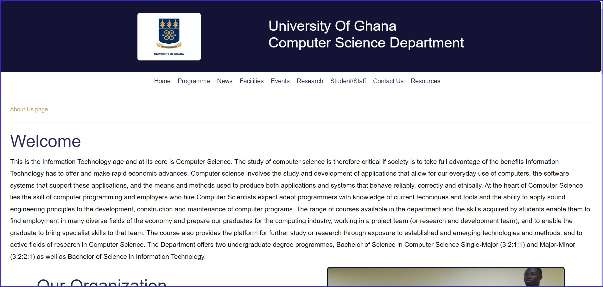
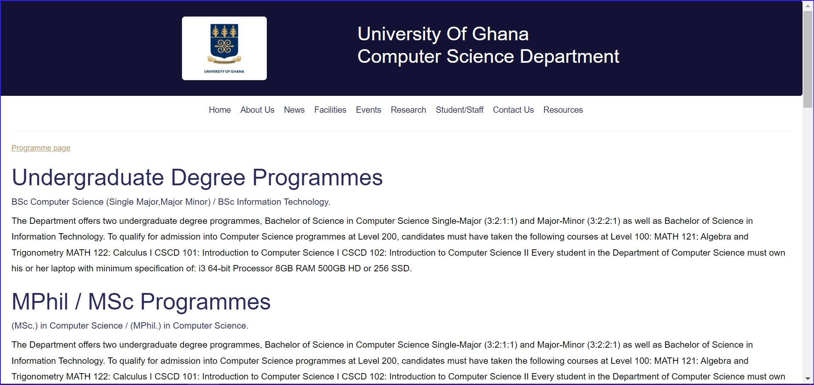
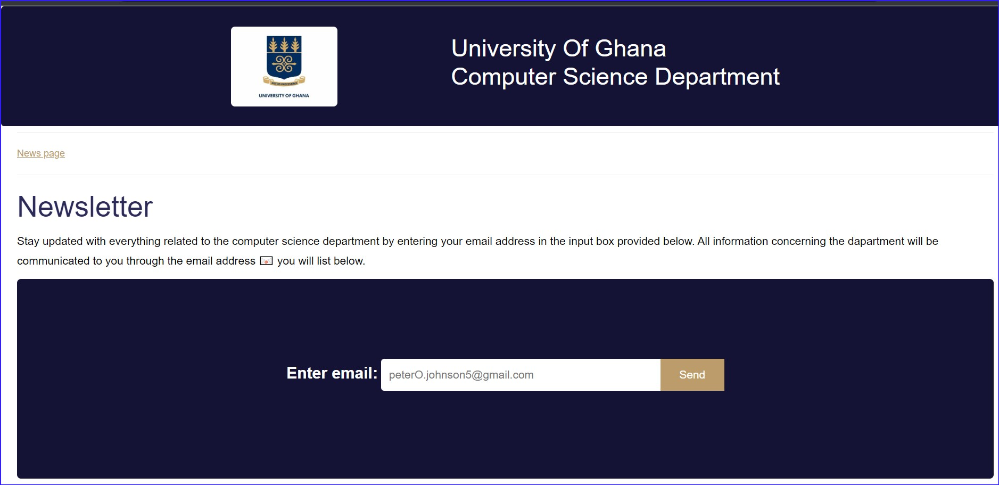
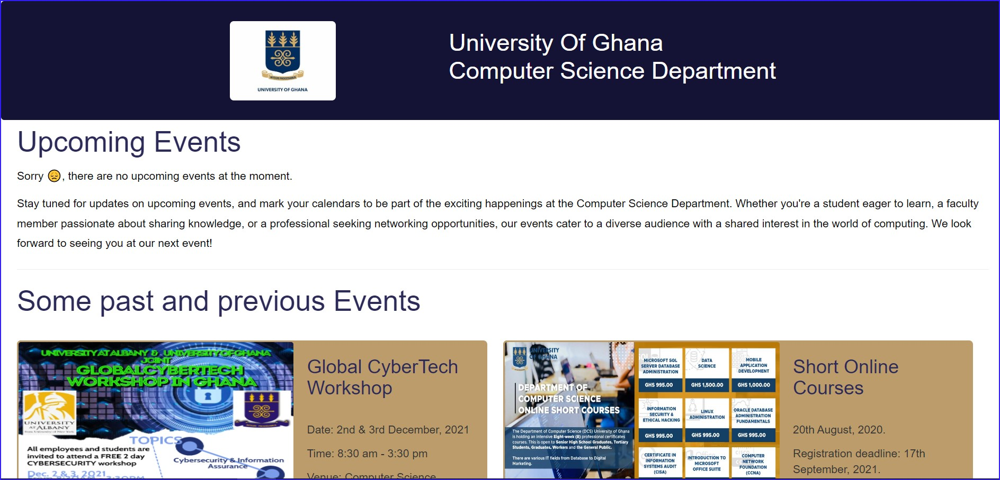
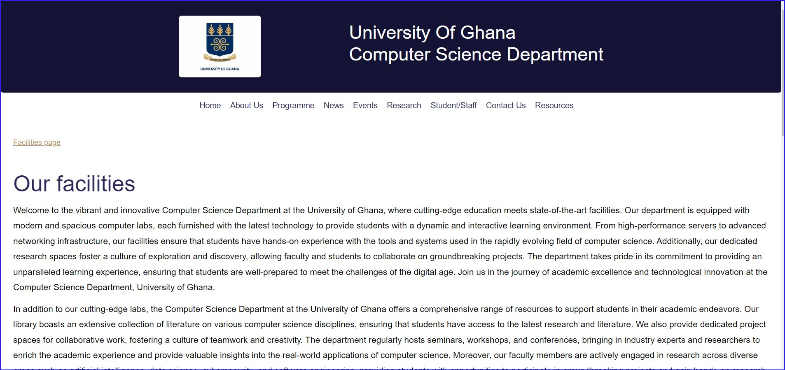
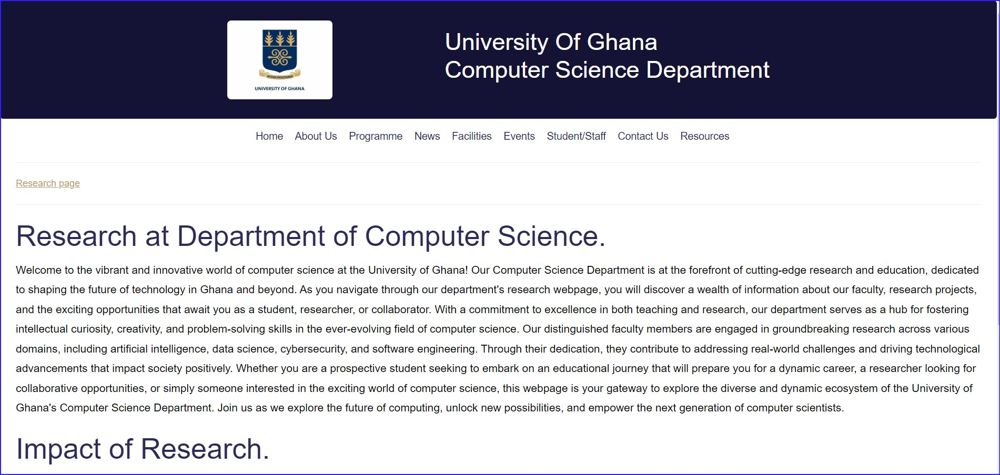
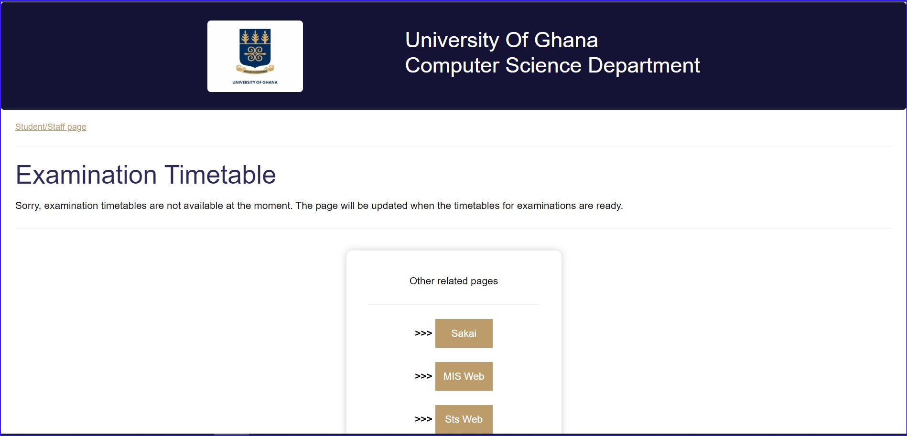
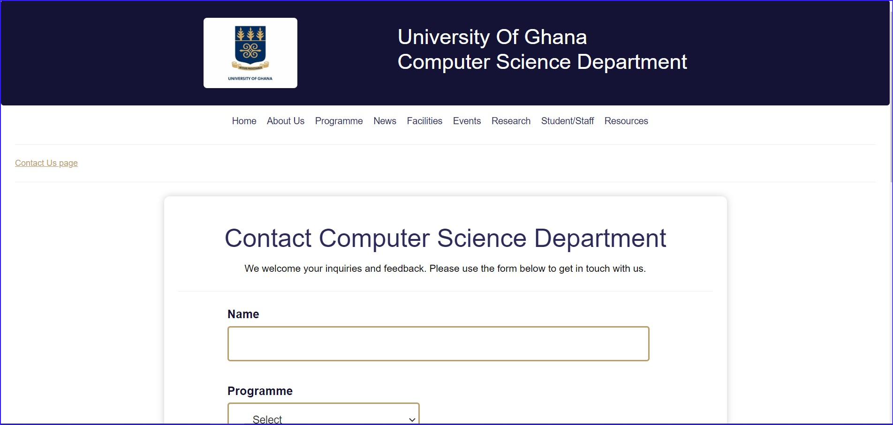
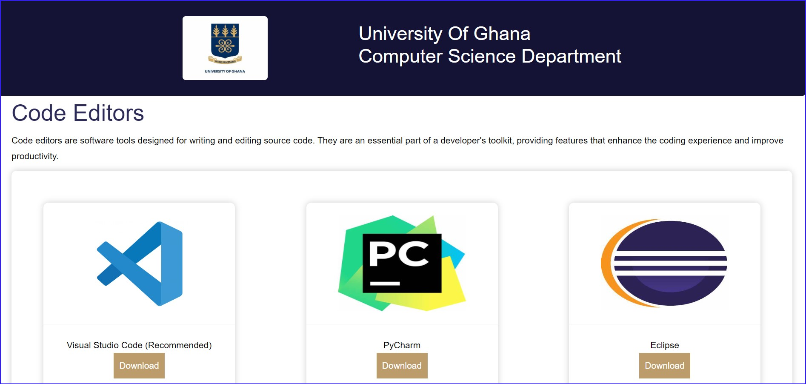

Welcome to Department of Computer Science,University of Ghana-Legon. This website was created with the purpose of The purpose of creating a Computer Science Department website is to serve as a centralized online platform that fulfills various objectives related to communication, information dissemination, and community building within the department.

To clone this project to your local machine, follow these steps:

1. Open your terminal or command prompt.
2. Navigate to the directory where you want to clone the project.
3. Run the following command:

```bash
git clone https://github.com/Lilsage9/11205670_DCIT-205
```

### Setting up the Project

1. Navigate to the project directory:

```bash
cd [project_directory]
```

2. Install the necessary dependencies:

```bash
npm install
```

3. [Include any additional setup steps if necessary]

4. Run the project:

```bash
npm start
```

Your project should now be running locally at [localhost:3000] (or another port if specified).

## Author Information

Name:Emmanuel Sagoe
Student ID: 11205670

## Screenshots













## Project Learnings

Through working on this project, I have gained:

- Proficiency in designing and developing user interfaces using HTML, CSS, and JavaScript.
- Understanding in the importance of project planning, including defining requirements, creating timelines, and    setting milestones.
- The importance of documenting code for better maintainability and collaboration.
- Knowledge in writing clear and concise Readme files to guide others in using and contributing to the project.
- Knowledge on how to add images to READEME files.
- Knowledge on how to fork a repository , commit changes and create a pull request.

